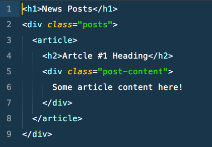
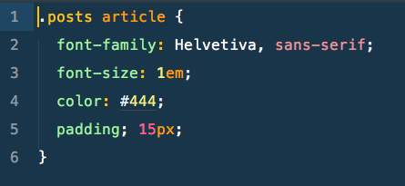

# Hello, World Wide Web!
### Beginners Coding Workshop - Stage #0

## What makes up a website?
Bring on the languages of the Internet!

### HTML - Hypertext Markup Language

Gives content structure and hierarchy.

### CSS - Cascading Style Sheets

Gives the content colors, fonts, and design.

### JS - Javascript
Not covered in this course, Javascript helps with user interactions. When a button is clicked, what should happen?

Checkout a Bootstrap Modal example:
https://codepen.io/DawsonMediaD/pen/byDqv

## How do these languages work together?

## The Browser
With the above ingredients, the browser knows what to do with them.

1. Browser --> Google.com
1. Google.com --> Web Server
1. Web Server --> Google Server
1. Google Server --> HTML/CSS/JS
1. HTML/CSS/JS --> Browser (back again)

## Where do I go from here?
Learning to code is doable. Start here:
* Find a passion project.
* Find a mentor.
* Code every day.

## Tools of the Trade
* text editor (Ex: [Sublime Text](http://www.sublimetext.com/), [Atom](https://atom.io/), [Visual Studio Code](https://code.visualstudio.com/))
* Inspector tool (Ex: Chrome inspector)
* Boilerplate (Ex: [HTML5 Boilerplate](https://html5boilerplate.com/))
* Playground area (Ex: [Codepen](http://codepen.io))
* [Github](http://github.com) (Also learn: Command Line and Git)
